# Cloud Native with Serverless

## Overview 
---------------------------------------
Cloud-Native applications are based on microservices architecture, which can drastically improve the scale in large applications by creating autonomous subsystems (microservices) that can be deployed. These microservices can be scaled independently from other areas of the application, while lowering costs in the long term and increasing evolution agility.

The Azure serverless architecture provides the following capabilities for the creation and deployment of the cloud native applications:
* Event-driven functions—without the need to explicitly provision or manage infrastructure—with **Azure Functions**
* Globally distributed, multi-model databases with **Azure Cosmos DB**.
* Highly available and redundant storage with **Azure Storage**. 
* Over 200 out-of-the-box connectors for **Logic Apps** to integrate external apps, data, systems and services.
* **Event Grid** to power the event-driven and serverless apps.

## Key Takeaways
-------------------------------
The key takeaways of this demo are:
* Cloud-native applications are at the heart of businesses that are differentiating through software and require to scale rapidly to cater to business needs.
* Serverless cloud computing is catching on universally at break-neck speeds and will ultimately revolutionize the way we develop, build and operate applications in the cloud.
* Azure provides a complete serverless platform to improve developer productivity, with focus on business goals, to build intelligent apps that can be brought to the market faster.

## Demo Scenario
------------------------------
In this demo, we will be showcasing the capabilities of serverless architecture by setting up a cloud native app for analyzing the customer tweets for **SmartHotel360**, a fictitious smart hospitality company. 

We will use a Node.js based website built with Visual Studio Code to analyze customer sentiments from Twitter using the **Text Analysis Cognitive Services** APIs. This website uses Azure services like **Cosmos DB**, **Azure Functions** and **Logic Apps**.

  <p align="center">
    
  </p>

## Exercise 1: Getting Started
-------------------------------------

1. The following prerequisites are needed to use the code in this repository: 

- Git
- [Docker](https://www.docker.com/get-docker)
- [Node.js](https://nodejs.org) (Latest LTS)
- [Visual Studio Code](http://code.visualstudio.com), with the following Azure-related extensions installed:
     [Azure App Service](https://marketplace.visualstudio.com/items?itemName=ms-azuretools.vscode-azureappservice)
     [Azure Cosmos DB](https://marketplace.visualstudio.com/items?itemName=ms-azuretools.vscode-cosmosdb)
     [Azure Functions](https://marketplace.visualstudio.com/items?itemName=ms-azuretools.vscode-azurefunctions)
     [Azure Storage](https://marketplace.visualstudio.com/items?itemName=ms-azuretools.vscode-azurestorage)
     [Docker](https://marketplace.visualstudio.com/items?itemName=PeterJausovec.vscode-docker)
- [Azure CLI](https://docs.microsoft.com/en-us/cli/azure/install-azure-cli?view=azure-cli-latest)
- [.NET Core SDK](https://www.microsoft.com/net/core) (prerequisite to the Azure Functions CLI)
- [Azure Functions CLI](https://github.com/Azure/azure-functions-cli)

2. Launch **Visual Studio Code** and open the repository. Select the **arm** folder in the Visual Studio Code editor to view the files.

3. Click on the PowerShell script file  **Deploy-AzureResourceGroup.ps1** to load the **PowerShell Integrated Console** terminal window automatically in the Visual Studio Code editor. 

   Type the command **.\Deploy-AzureResourceGroup.ps1**, press the **Enter** key and wait until the execution is completed. 

    >It can take up to 3 minutes to complete the script execution.

    ```
    .\Deploy-AzureResourceGroup.ps1
    ```

   <p align="center">
    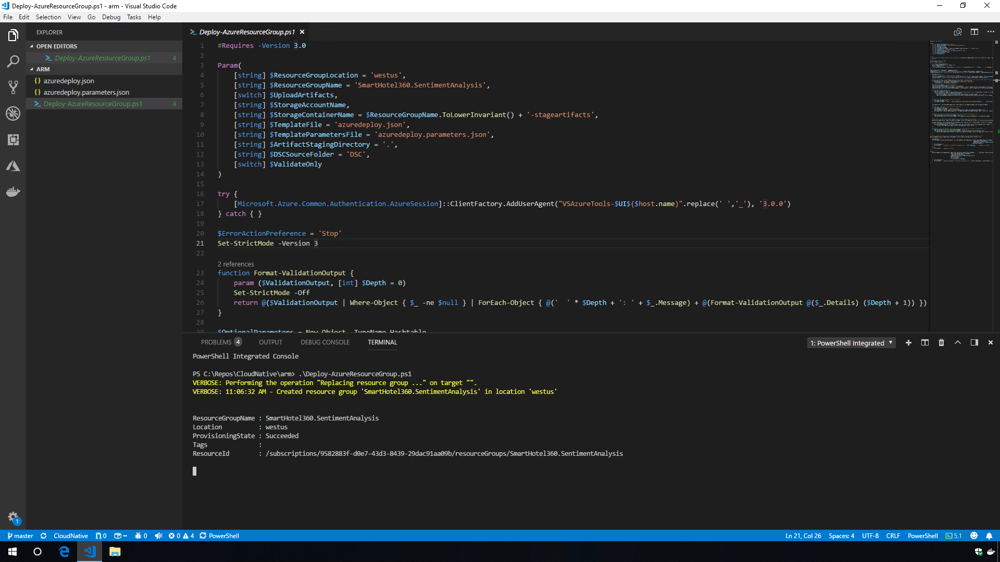
  </p>
      > **Talk Track:** In this demo, we will configure an application for analyzing the customer sentiments for SmartHotel360 based on the tweets from users on Twitter. Multiple Azure technologies have been used in the application which will covered in detail during the demo. We will now execute a PowerShell script that will automatically create a resource group with all the necessary resources for the setup. We will be configuring each of these resources to accomplish the requirement. 

## Exercise 2: Azure Resources Configuration

Once the script execution is completed, a resource group with all the required resources for this demo app will be created.

1. Launch the Azure portal in the **Microsoft Edge** browser and make sure that the newly created resource group **SmartHotel360.SentimentAnalysis** has been created.

1. Select the **Graph** cosmos db (starts with the name sh360dbgraph*******) from the resources list and click on the **Data Explorer** option. Click on the **New Graph** button, provide **TweetsDB** as the new Database Id, **Tweets** as the Graph Id, choose the storage capacity as **Fixed (10 GB)** and then click on the **OK** button. Close the Data Explorer window to navigate back to the resource group.

    <p align="center">
    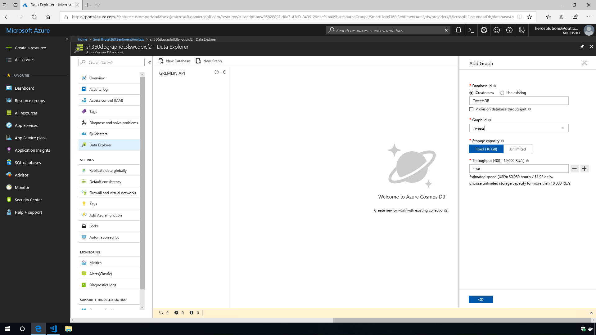
  </p>

    > **Talk track:** We need to first create a database and collections in both Cosmos DBs. **Azure Cosmos DB** is Microsoft's globally distributed, multi-model database. With the click of a button, Azure Cosmos DB enables you to elastically and independently scale throughput and storage across any number of Azure's geographic regions. It offers throughput, latency, availability, and consistency guarantees with comprehensive service level agreements (SLAs), something no other database service can offer

1. Select the **SQL** cosmos db (starts with the name sh360dbsql*******) from the resources list and click on the **Data Explorer** option. Click on the **New Collection** button, provide **TweetsDB** as the new Database Id,  **Tweets** as the Collection Id, choose the storage capacity as **Fixed (10 GB)** and then click on the **OK** button. Close the Data Explorer window to navigate back to the resource group.

    <p align="center">
    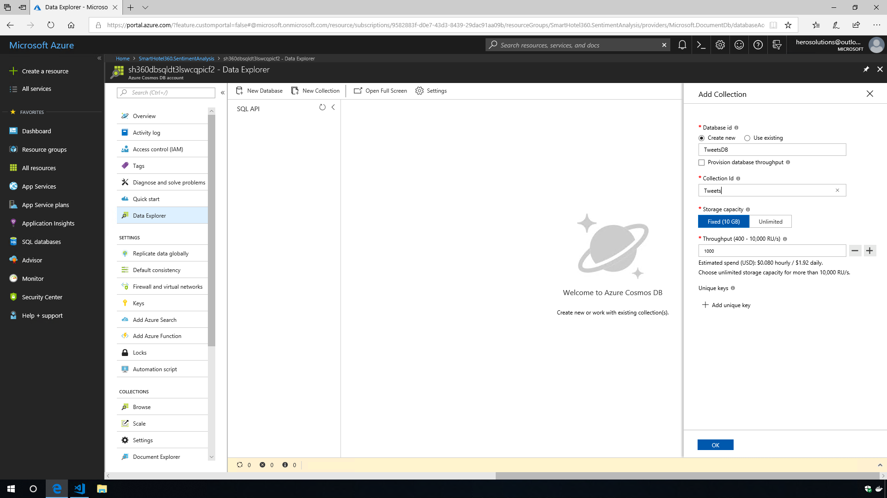
  </p>

      > **Talk Track:** We will now configure the Azure Logic App for reading data from the tweets with the configured hashtag. We will setup the trigger, hashtag, read frequency and the action to be performed for the logic app. 

## Exercise 3: Configuring Azure Logic App

1. Select the newly created Logic App from the resource group list and click on the **Logic App designer** option from its menu list.

    >**Talk Track:** Azure Logic Apps provides a way to simplify and implement scalable integrations and workflows in the cloud. It provides a visual designer to model and automate your process as a series of steps called a workflow. There are many connectors, more than 200, across cloud and on-premises services to quickly connect a serverless app to other APIs. 

1. A logic app begins with a trigger and after firing can begin many combinations actions, conversions, and condition logic. We will select **When a new tweet is posted** for the trigger. Provide the Twitter credentials and click on the **Sign in** button in the Twitter trigger. Next click on the **Continue** button.

    <p align="center">
    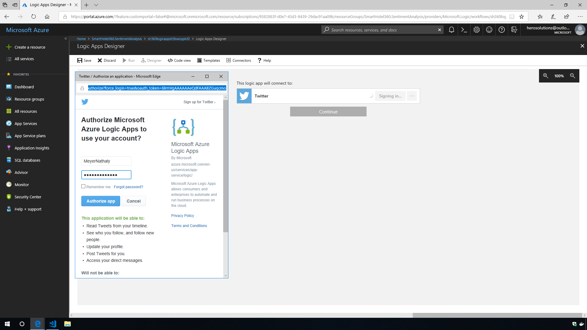
  </p>

1. Next, we will specify a hashtag that we will monitor. Type **#SmartHotel360** in the **Search Text** field and click on the **Edit** button beside the *Using the default values for the parameters* text to modify the monitoring frequency to **3 seconds**.

    <p align="center">
    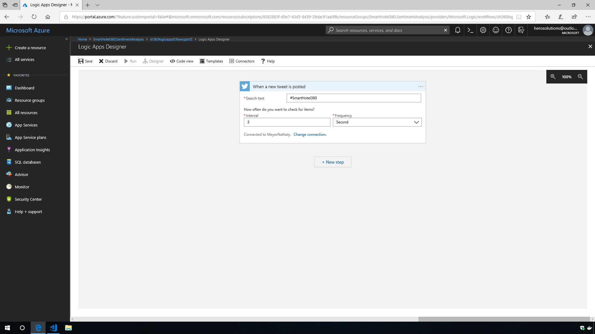
  </p>

1. Click on the **New step** button and then click on the **Add an action** button. Type **Cosmos** in the search bar and select the option **Azure CosmosDB - Create or update document**.

    <p align="center">
    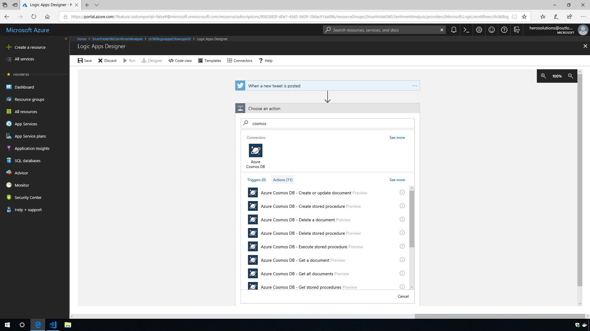
  </p>


1. Provide the connection name as **CosmosDBConnection**, select the SQL API Cosmos DB (starts with the name sh360dbsql*******) and click on the **Create** button. 

1. Select the **TweetsDB** value for the Database ID field, **Tweets** for the Collection ID field and paste the below code in the Document field. Click on the **Save** button at the top of the Logic App Designer window and then click on the **Run** button. Make sure that a notification **Successfully checked the trigger** appears every 3 seconds in the Azure portal notification pane.

    ```
    {
        "created": "@triggerBody()?['CreatedAtIso']",
        "id": "@triggerBody()?['TweetId']",
        "text": "@triggerBody()?['TweetText']",
        "user": "@{triggerBody()?['TweetedBy']}"
    }
    ```

   <p align="center">
    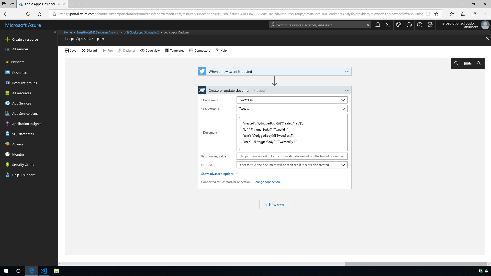
  </p>

     > **Talk Track:** Now we will configure the Azure Function to trigger the Cognitive API to write the sentiment analysis information to the database. **Azure Functions** is a solution for easily running small pieces of code, or "functions," in the cloud. You can write just the code you need for the problem at hand, without worrying about a whole application or the infrastructure to run it.

## Exercise 4: Configuring Azure Functions

1. In the Visual Studio Code editor, open the **Functions** folder under the path **C:\Repos\CloudNative**. 

1. Select the **local.settings.json** file and provide the string connections for the Azure Storage and Cosmos DB (SQL API). You will find these connections strings in the Azure Portal.

   To fetch the connection strings for the Azure Storage and the Cosmos DB, click on the **Azure icon** in the Visual Studio Code editor. Wait until the data loads and then expand the **Azure Hero Solutions subscription** under the **Functions, Storage and Cosmos DB** windows. In the **Cosmos DB** window, right-click on the created Cosmos DB and click on the **Copy Connection String** option to copy the connection string. Repeat the steps for the **Storage** connection string in the **Storage** window.

    <p align="center">
    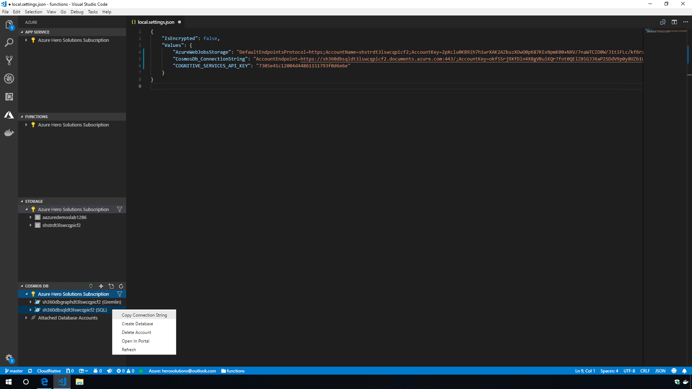
  </p>

1. For the Cognitive API key, navigate back to the resources list and click on the **Cognitive Services** resource (starts with the name sh360cognitive...). Click on the **Keys** option in the menu, copy the **Key 1** value and paste the value for the **COGNITIVE_SERVICES_API_KEY** variable in the settings file. Save and close the file.

    <p align="center">
    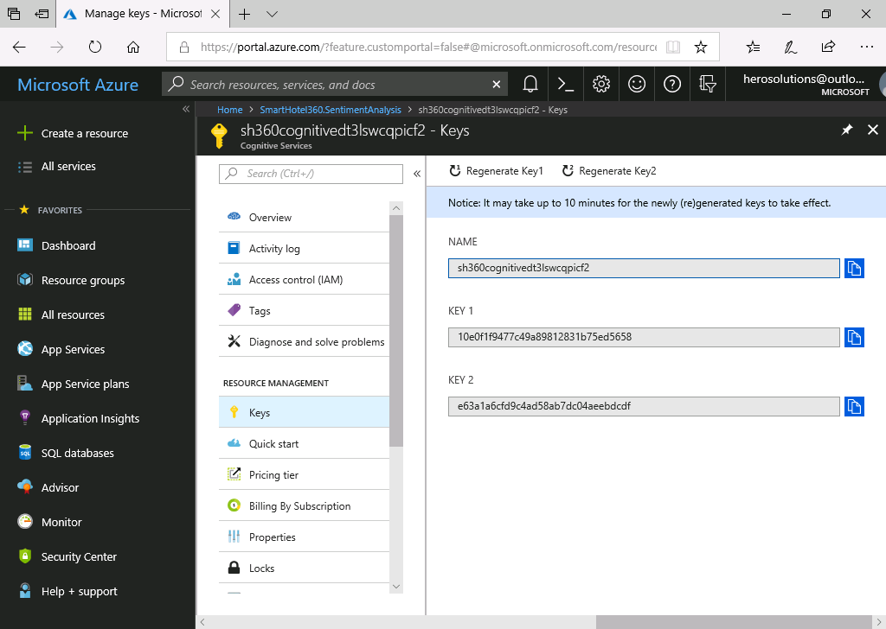
  </p>
    
1. Select the **dbconfig.js** file under the **AnalyzePendingTweet** folder in the Explorer to view its content. Navigate to the Graph API Cosmos db resource and click on the **Keys** option to copy the **URI** and **Primary Key** values and paste it in the dbconfig file. Save and close the file. 

   > The endpoint value must not include the protocol (https://) and the port number. 

    <p align="center">
    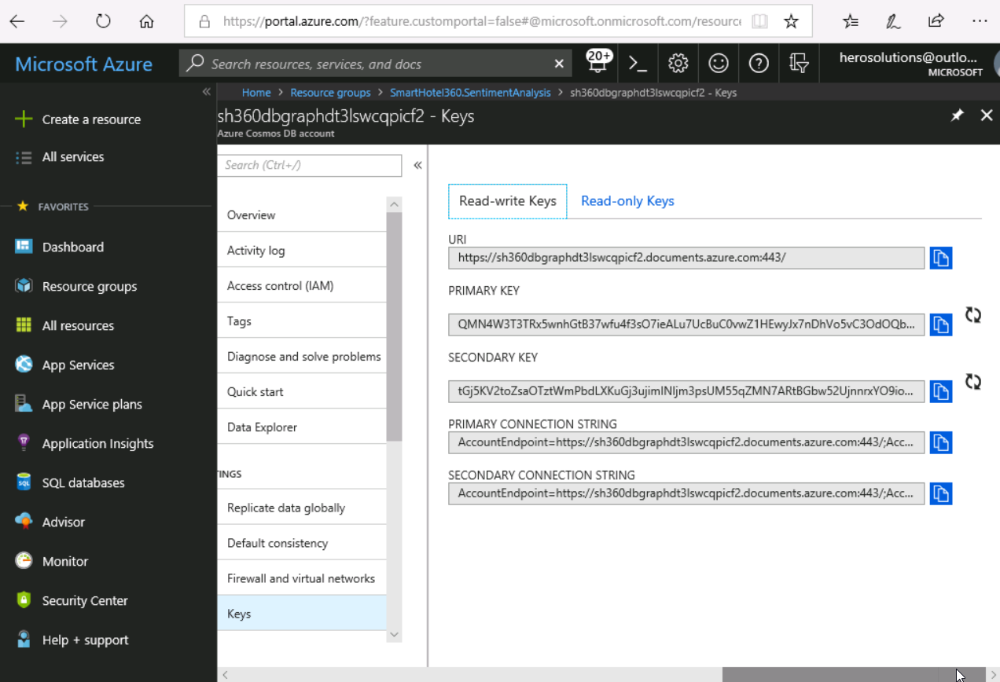
  </p>

    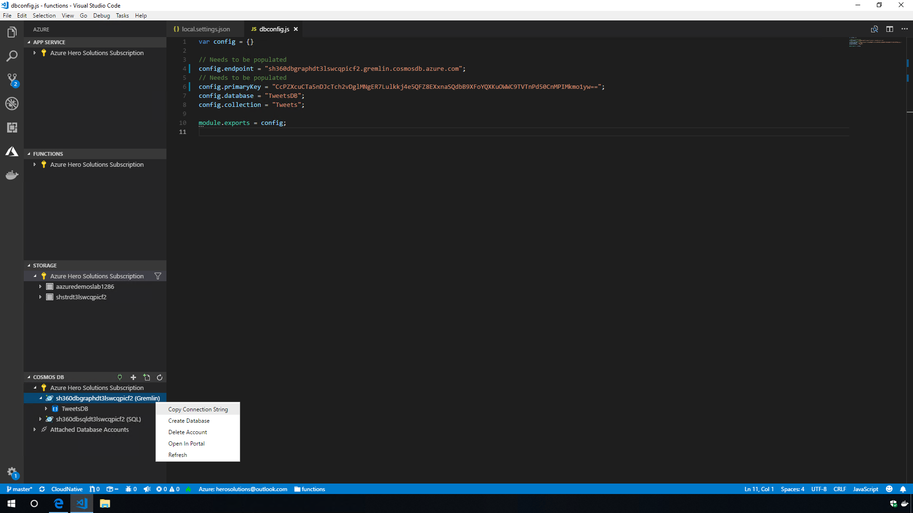
    <p align="center">
    
  </p>

1. In the **Integrated terminal** window under the Visual Studio Code Editor **View** menu, execute the following command: 

    ```
    func extensions install --package Microsoft.Azure.WebJobs.Extensions.CosmosDB --version 3.0.0-beta7
    ```

    <p align="center">
    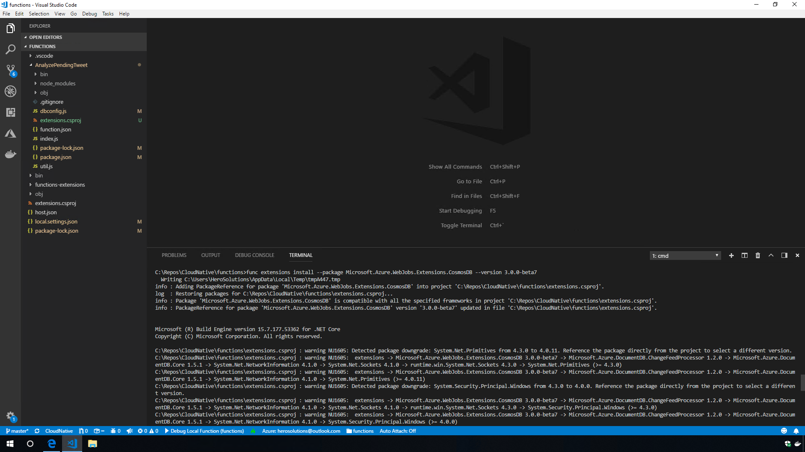
  </p>

    > **Talk Track:** We have to configure the database connection to the Cosmos Graph DB (Gremlin), install the Cosmos DB package and update the npm packages in the AnalyzePendingTweet folder. 

1. Execute the following commands sequentially in the Integrated terminal window to restore the packages. 

    ```
    cd AnalyzePendingTweet
    ```
    ```
    npm install
    ```

    <p align="center">
    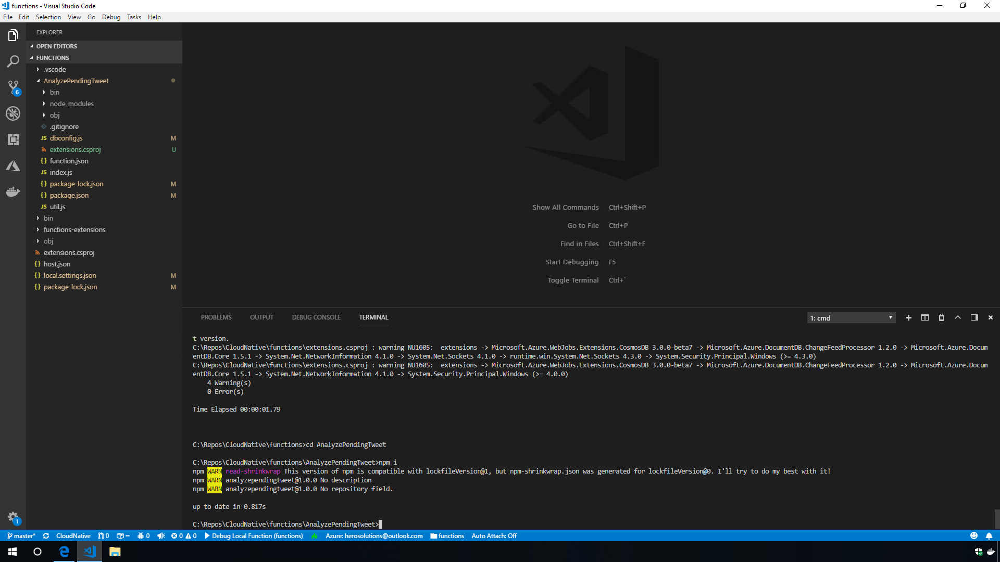
  </p>

     > **Talk Track:** We will now debug the Azure function locally to ensure that it works as expected. 

## Exercise 5: Debugging the Azure Function locally

1. Press the **F5** key or use the debug button in Visual Studio Code to debug the Azure Function locally. 

    <p align="center">
    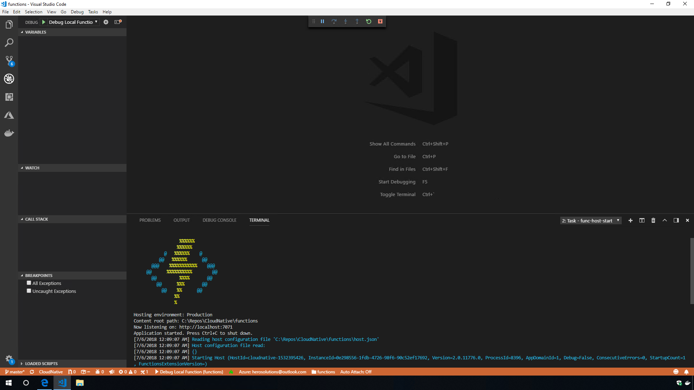
  </p>

1. Post a tweet with the hashtag **#SmartHotel360**.

    <p align="center">
    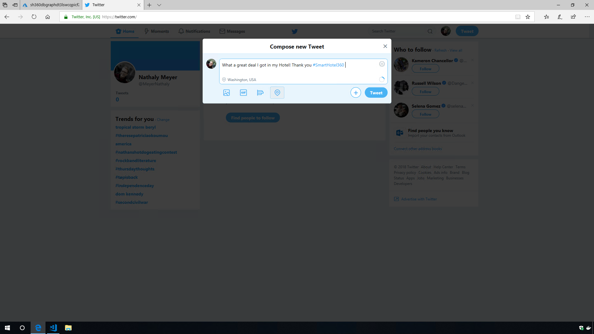
  </p>

1. In the Azure Portal, navigate to the Logic App service to check if the trigger is executed.

    <p align="center">
    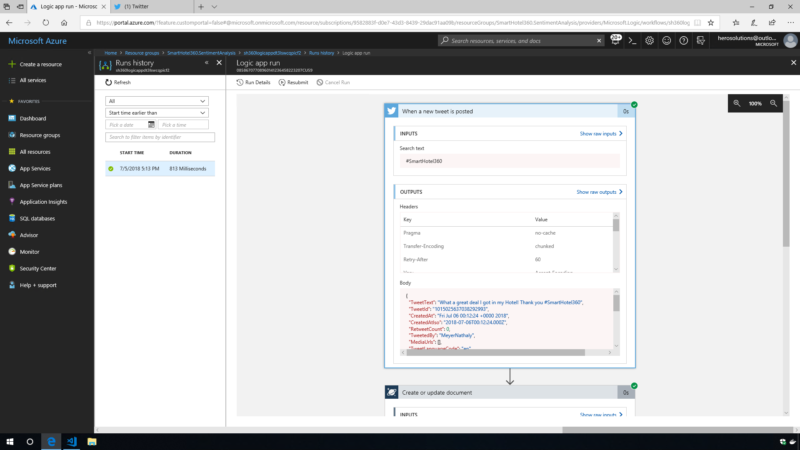
  </p>

1. In the Visual Studio Code editor, debug the code to check if the tweet was captured from the Cosmos SQL DB and stored in the Cosmos Graph DB.

    <p align="center">
    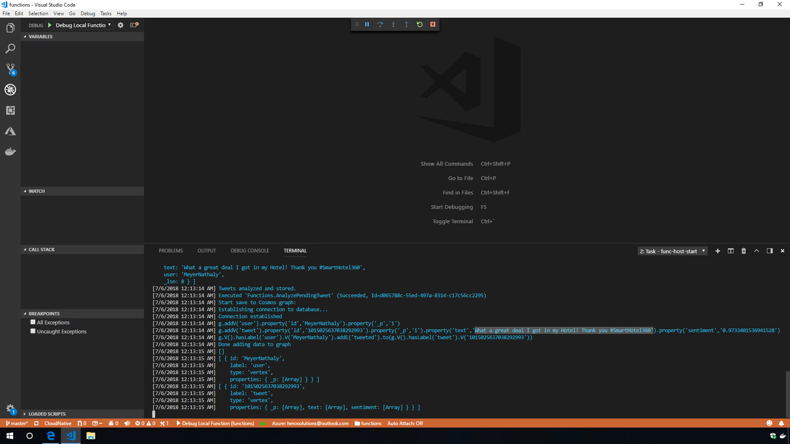
  </p>

1. Stop the debug mode. Navigate to the Cosmos Graph DB from the Azure extension and select the **Tweets** under the **TweetsDB**, click on the **Execute** button in the next window to query the Graph and view the data in it.

    <p align="center">
    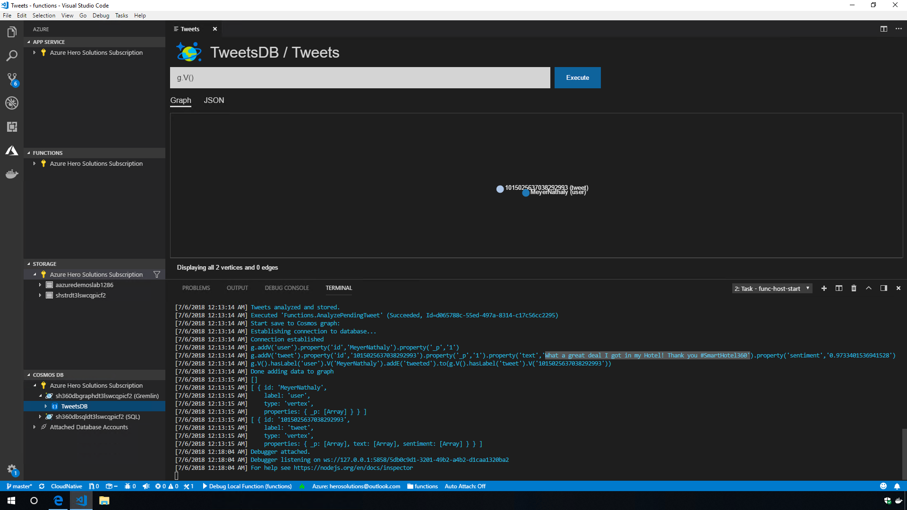
  </p>

1. Right-click on the **Function** folder under the Explorer and click on the option **Deploy to Function App**, select the subscription and the Function App to create a package and deploy into the Azure function. 

   > If a warning pops-up, click on the **Yes** button to override any current setup and proceed with the deployment.

    <p align="center">
    
  </p>

    <p align="center">
    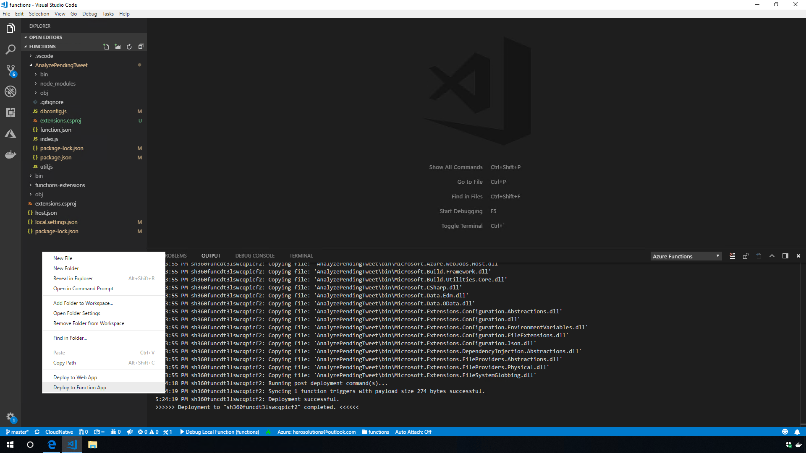
  </p>

1. In the Azure Portal, navigate to the Azure Function and verify that the Function was deployed successfully and enabled.

    <p align="center">
    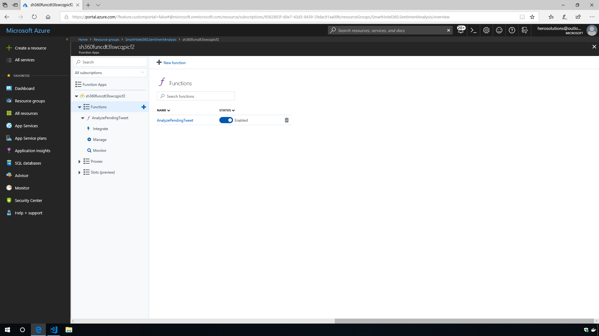
  </p>

     > **Talk Track:** We will now configure the Sentiment Analysis website to run against the sample data, to view the graph modelling. 

## Exercise 6: Sentiment Analysis Website

1. In the Visual Studio Code Editor, expand the folder **util** under the **web** folder and select the file **dbconfig.js**. For the **config.endpoint** value, paste the **key** value used in the *Step 3* of **Exercise 4**. Select the **Keys** option under the menu list and copy the **Primary Key** value. Paste this value for **config.primarykey** in the file. Save and close the file. 

    <p align="center">
    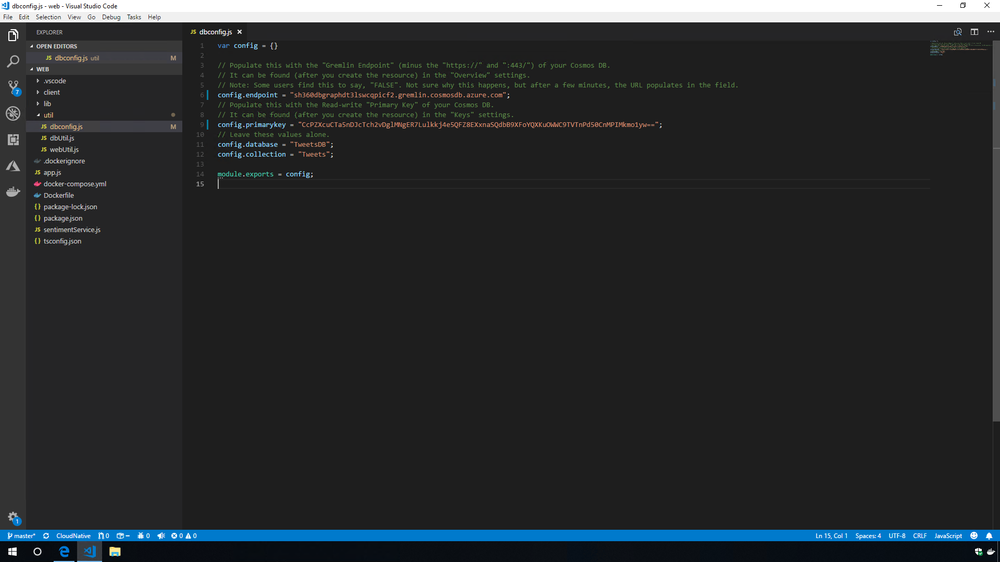
  </p>

1. Expand the **js** folder under the **client** folder and select the **webconfig.js** file. Provide the **Bing Maps API Key** which is available as a key value in the created Azure Resource Group under *Keys* menu as **Query Key** (starts with the name sh360bingapp...).

    <p align="center">
    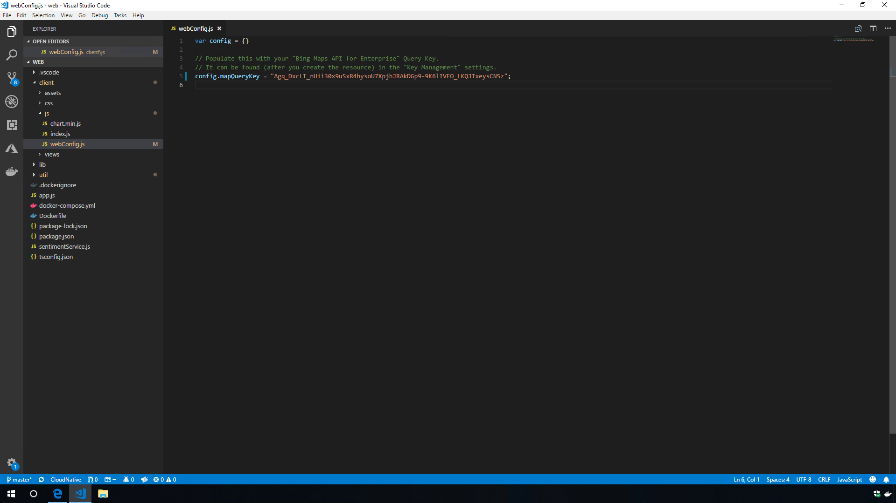
  </p>

1. Uncomment the line **15** in the file **app.js**. Save and leave the file open. You will need to comment this line before publishing the website.

    <p align="center">
    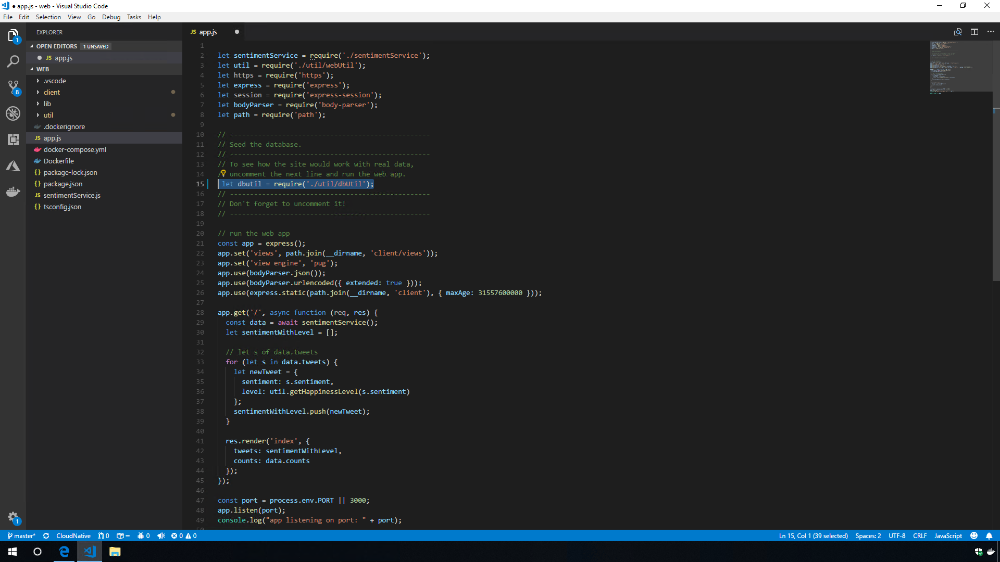
  </p>

    > The website will show an overview of the feedback received from Twitter. Since there is only a single tweet currently, we need to populate sample data to showcase the capabilities of the website. 

1. Before running the website, restore the packages using the command **npm i** in the terminal window.

    <p align="center">
    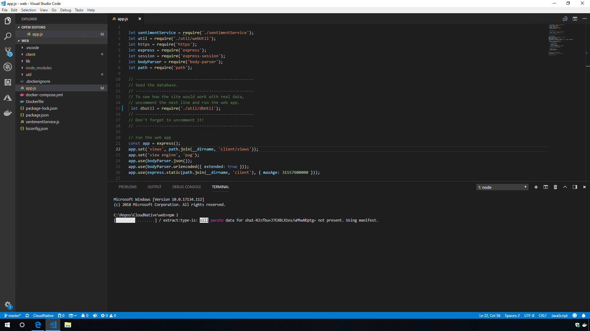
  </p>

1. Once the restoration is complete, press the **F5** key or use the Debug button in the Visual Studio Code to debug the application.

    <p align="center">
    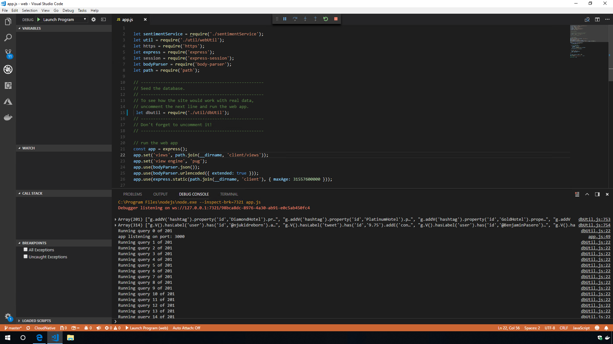
  </p>

1. Open a new tab in the Edge browser and type the URL http://localhost:3000. Click on one of the highlighted points in the map to view the sentiment on the hotel.

    <p align="center">
    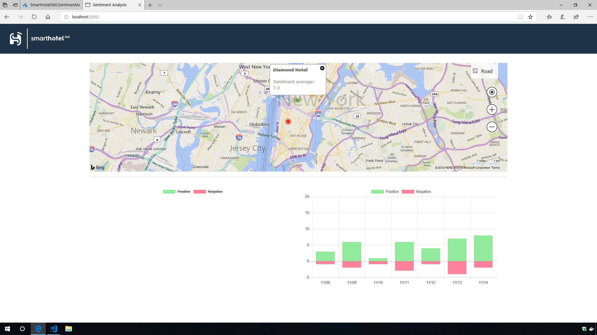
  </p>

1. Stop debugging and comment the **line 15** in the **app.js** file. Execute a new query in the Cosmos Graph DB to view the sample data. 

    <p align="center">
    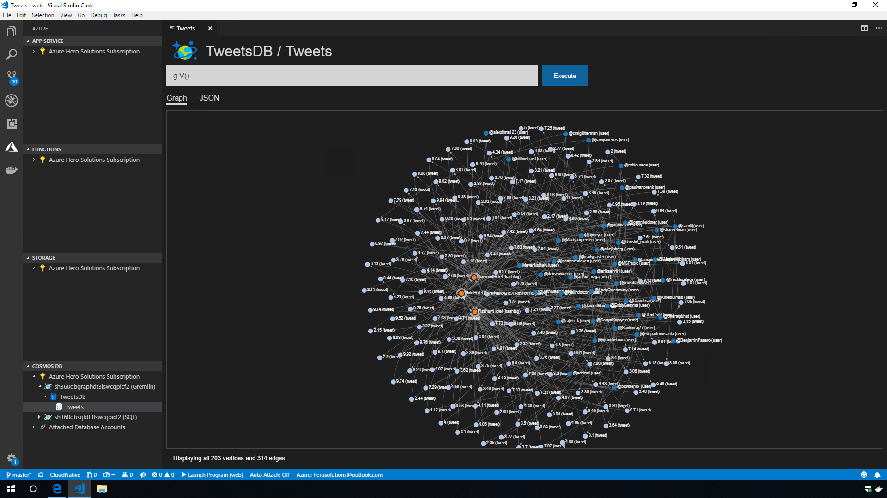
  </p>

1. To publish the website in Azure, you will need to execute a docker compose. Open the **Command Palette** by pressing the **Ctrl+Shift+P** keys or launch it from the **View** tab of Visual Studio Code editor. Type the command **Docker: Compose Up** and then select the **docker-compose.yml** file from the **web** folder. 

    <p align="center">
    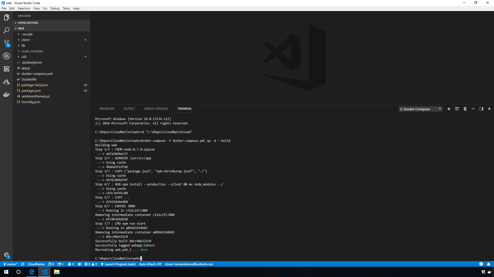
  </p>

1. You will need to connect to the Azure Container Registry and push the docker image that was created. Navigate to the Azure Portal and select the **Azure Container Registry** under the resources group list. Select **Access Key** option and copy the Username, Password and Login Server values in a notepad. Execute the following commands by substituting the variables.

    ```
    docker login -u {username} -p {password} {loginServer}
    docker tag webapp:latest {loginServer}/webapp
    docker push {loginServer}/webapp
    ```
    <p align="center">
    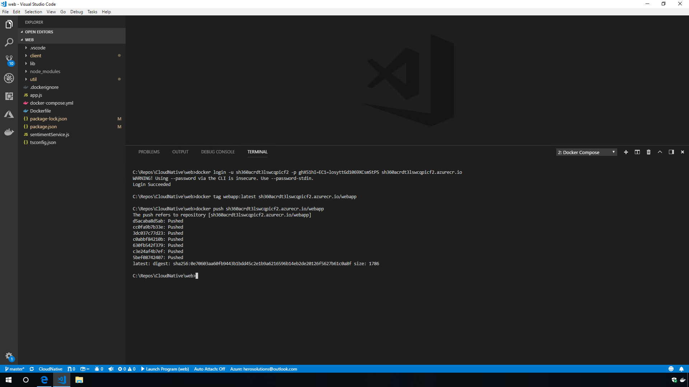
  </p>

1. Once the image is pushed to the Azure Container Registry, right-click on the image under the Azure Container Registry and choose the **Deploy Image to Azure App Service** option. Select the Resource Group, Hosting Plan and provide a name for the App Service.

    <p align="center">
    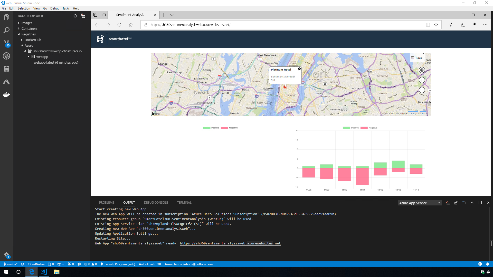
  </p>

## Summary
--------------------
The cloud Native apps are revolutionizing the way we develop and run applications. In this demonstration, we have shown how you can build a cloud-native application using some of the technologies such as Containers, Serverless with Azure Functions, Cosmos DB, etc., quickly and easily with Azure.

## Feedback
-------------------------
Did you like the demo? Did you face any issues? Do you have ideas to include in the demo? Please share your inputs via email on [Azure App Dev Demos](mailto:azureappdevpstdemos@microsoft.com). We appreciate your feedback.